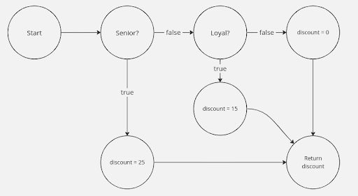

### 컴파일러는 어떻게 리턴문에 구멍이 뚫려 있는지 구분할 수 있을까?

- 모든 경우의 수에서 안전하게 리턴된다 라고 판단하는 과정은 수학적 모델을 따름 (도달 가능성 분석)
- 자바에서는 컴파일러가 코드를 읽을 때 다음과 같은 체크리스트를 구성하여 이 코드가 닫힌 구조인가를 체크함.
    - 제어 흐름 분석
        - 제어 흐름 그래프 CFG를 그림
        - 각 분기점은 노드, 코드 실행 흐름은 화살표(엣지)가 됨
        - 그래프의 시작점에서 끝점으로 가는 모든 경로를 추적했을 때 경로 도중에 리턴이나 throw같이 종착역을 만나지 않고 끝점에 도달하는 경로가 있다면 컴파일 에러 발생시킴
    - 분기별 판단 로직
        - 컴파일러는 오직 else 나 default가 있을 때만 모든 경우의 수가 닫혔다고 인정함.
        - 이는 변수의 값을 계산하지 않고 구조를 믿는다는 걸 원칙으로 하기 때문

        ```java
        // 불완전한 구조 (수학적 추론으론 맞음)
        public int test(int a) {
        	if (a > 0) return 1;
        	if (a <= 0) return -1;
        	//IDE에서 컴파일 에러 표시함
        	//[컴파일러의 걱정] 만약 A도 아니고 B도 아니면? 
          // "난 a가 뭔지 몰라. 그냥 두 if문 다 false가 나오면 여기서 뭘 반환해야 하지?"
        }
        
        // 완전한 구조 (컴파일 에러 X) 
        public int test(int a) {
        	if (a > 0) return 1;
        	else return -1;
        }
        ```

        - 컴파일러가 수학적 추론이 아닌 구조적 추론을 채택하는 이유는 조건문 안에서 값이 변하거나 단순한 부등호 논리가 아닌 if(a.isValid() && a.hasToken()) 과 같이 복잡한 로직이
          등장한다면 컴파일러가 이를 수하적 추론으로 계산하고 추적하는 것은 불가능에 가까움
        - 그렇다면 변수가 아니라 상수(final)라면?
            - 컴파일러는 변수를 추적하지 않을 뿐이지 상수는 추적함
            - 따라서 아래와 같이 상수를 사용할 경우 에러 발생 X

            ```java
            public int logic() {
                final boolean ALWAYS_TRUE = true; 
                if (ALWAYS_TRUE) {
                    return 100;
                }
            }
            ```

            ```java
            // CFG 예시용 코드 
            function checkDiscount(age, membershipDuration) {
              let discount;
              if (age > 60) {
                discount = 25; // Senior discount
              } else if (membershipDuration > 5) {
                discount = 15; // Loyalty discount
              } else {
                discount  0; // No discount
              }
              return discount;
            }
            ```

          ### CFG

          
