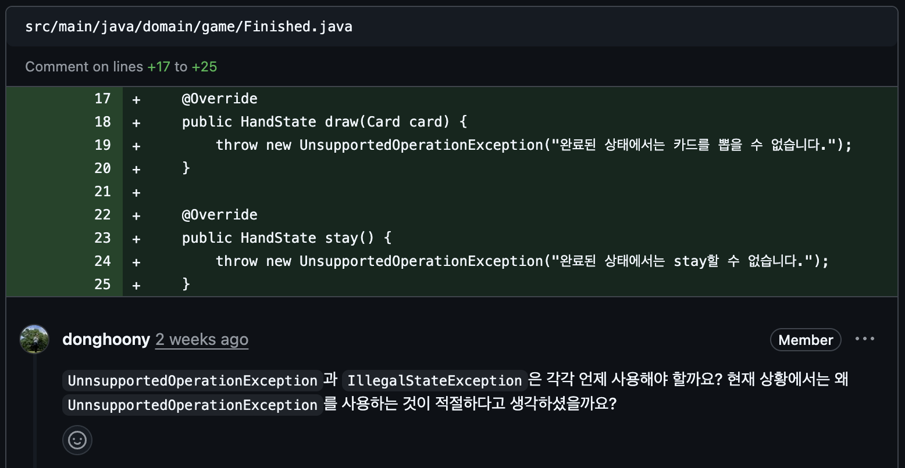

## 싱글톤 발전 과정에서 중요하게 다루는 3가지 요소

- 초기화 시점 (Eager / Lazy) : 미리 메모리에 탑재할건지? 아니면 나중에 필요할 때 탑재할건지?(후자가 더 유리)
- 동시성 문제 : 동시에 접근하게 되면 여러개 만들어질 수도 있음
- 코드의 간결성 : 코드 몇줄로 만들 수 있으면 좋자나

## 빌 푸 싱글톤

위 3요소들을 모두 충족하기 위해 소프트웨어 엔지니어 '빌 푸(Bill Pugh)'가 고안한 방식. **자바에서 클래스로 싱글톤을 구현할 때 가장 널리 쓰이고 권장되는 표준 방식임**

```java
public class BillPughSingleton {

    private BillPughSingleton() {
    } // private 생성자

    // static 내부 클래스 (Holder 역할)
    private static class SingletonHelper {
        private static final BillPughSingleton INSTANCE = new BillPughSingleton();
    }

    public static BillPughSingleton getInstance() {
        return SingletonHelper.INSTANCE;
    }
}
```

### 빌 푸 싱글톤의 핵심 특징 및 장점 (왜 사용할까?)

1. **완벽한 지연 초기화 (Lazy Loading):** `BillPughSingleton` 클래스가 로드될 때 인스턴스가 생성되지 않음. 누군가 `getInstance()`를 호출하여
   `SingletonHelper`를 참조하는 바로 그 순간에야 내부 클래스가 로드되며 인스턴스가 만들어집니다. (메모리 낭비 제로)
2. **자연스러운 Thread-Safe (동기화 오버헤드 없음):** 복잡하고 느린 `synchronized` 키워드를 전혀 쓰지 않음. 자바의 JVM(Java Virtual Machine)이 클래스를 로드하고
   초기화하는 과정 자체가 원래 스레드에 안전하게 설계되어 있다는 점을 영리하게 활용.
3. **간결한 코드:** DCL 방식에 비해 코드가 훨씬 깔끔하고 직관적.

참고) DCL 방식 예시 (이중 확인 잠금 (DCL, Double-Checked Locking)

```java
public class DCLSingleton {
    // volatile 키워드 필수!
    private static volatile DCLSingleton instance;

    private DCLSingleton() {
    }

    public static DCLSingleton getInstance() {
        if (instance == null) { // 1차 체크
            synchronized (DCLSingleton.class) {
                if (instance == null) { // 2차 체크 (여기서 비로소 생성)
                    instance = new DCLSingleton();
                }
            }
        }
        return instance;
    }
}
```

DCL 방식은 지연 초기화, 동시성 문제를 해결했지만, 코드가 다소 복잡함

## 빌 푸 싱글톤 사용에 대한 리뷰어의 반응 (비밥)



결론 : 싱글톤 인스턴스가 비대한 경우에 사용하면 좋겠다 (작으면 그냥 쓰던대로 써도 돼~)
